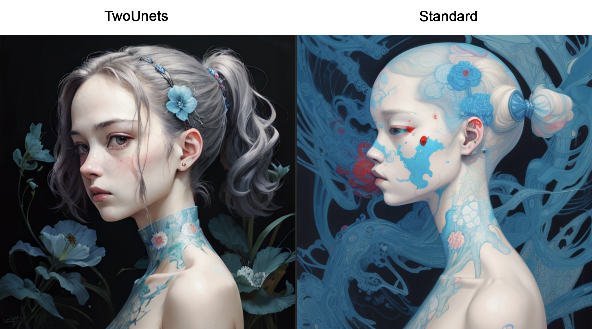

# StableTwoUnet



What if instead of using a negative prompt we used a negative model? In one case we can amp the style and effects of a 
finetuned model by letting the negative prediction be handled by the vase model and the positive by the finetune. This can be particularly
noticable if you let both the positive and negative prompt be the same, as then the only difference between predictions is just the model weights.


# Setup 🛠
```
pip install -r requirements.txt
```

# Inference 🚀
See the provided notebook

# Settings
- swap_step: value 0 to 1 denoting what % into inference to switch from the two unet prediction mode to standard inference
